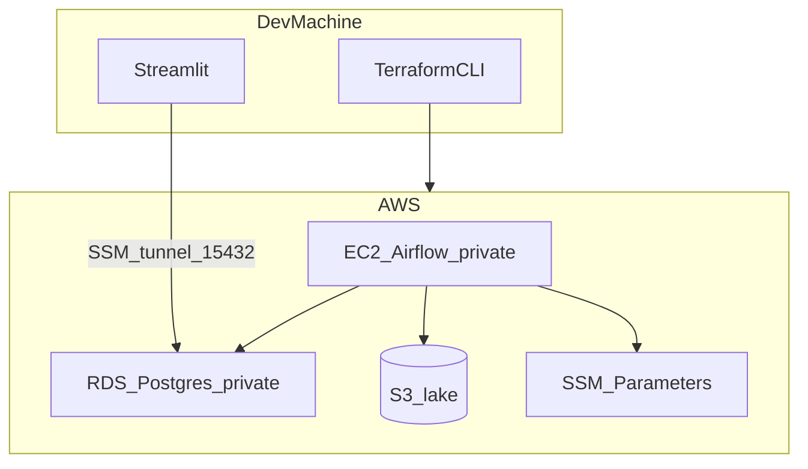

# netpulse

Telco network congestion hotspot intelligence pipeline — batch-oriented data engineering project with Airflow orchestration, a three-zone data lake, dbt marts, and a Streamlit dashboard.

See [PRD_netpulse.md](PRD_netpulse.md) for full product requirements.

## Phase 1: Local Development

### Prerequisites

- Docker Desktop
- Python 3.11+
- OpenCelliD Indonesia slice CSV (MCC 510) from [opencellid.org](https://opencellid.org)
- Simplified Indonesia province GeoJSON from [chmdznr/indonesia-geojson](https://github.com/chmdznr/indonesia-geojson)

Create and activate a virtual environment, then install dependencies:

```powershell
# Windows (PowerShell)
python -m venv .venv
.\.venv\Scripts\Activate.ps1
pip install -r requirements-local.txt
pip install -e .
```

```bash
# macOS / Linux
python -m venv .venv
source .venv/bin/activate
pip install -r requirements-local.txt
pip install -e .
```

### First-Run Setup

1. Copy environment file:
   ```bash
   cp .env.example .env
   ```

2. Place data files (not committed to git):
   - OpenCelliD CSV → `data/opencellid/` (e.g. `510.csv`)
   - Province GeoJSON → `data/boundaries/indonesia_provinces_simplified.geojson`
     ```bash
     python scripts/download_boundaries.py
     ```

3. Start local stack:
   ```bash
   docker compose up -d
   ```

4. Initialize MinIO bucket:
   ```bash
   python scripts/init_minio_buckets.py
   ```

5. Seed reference data (with venv activated):
   ```bash
   python scripts/seed_opencellid_local.py
   python scripts/seed_subscriber_master.py
   ```

   `.env.example` defaults to **portfolio demo** settings (`TOWER_SAMPLE_SIZE=100`, `SUBSCRIBER_COUNT=50000`). Re-seed after changing either value.

6. Run pipeline backfill (keep DAGs **paused** in the Airflow UI until backfill completes).

   Run from a **bash terminal** (Git Bash or WSL on Windows — not PowerShell):

   **Reset** (only if you see `RUNNING` conflicts from unpausing DAGs too early):
   ```bash
   bash scripts/reset_airflow_runs.sh
   ```

   **Backfill all DAGs** (recommended):

   Acquisition and staging backfill per day; **dbt and alerts run once** at the end (they rebuild from all staging data):

   ```bash
   bash scripts/backfill_pipeline.sh 2025-05-25 2025-06-28
   ```

   If acquisition + staging already finished and only dbt failed, run these manually:

   ```bash
   docker compose exec airflow-webserver bash -c "cd /opt/airflow/dbt && dbt seed --profiles-dir /opt/airflow/dbt && dbt run --profiles-dir /opt/airflow/dbt && dbt test --profiles-dir /opt/airflow/dbt"
   docker compose exec airflow-webserver airflow tasks test netpulse_alerts evaluate_hotspot_alerts 2025-06-28
   docker compose exec airflow-webserver airflow tasks test netpulse_alerts evaluate_peak_hour_alerts 2025-06-28
   docker compose exec airflow-webserver airflow tasks test netpulse_alerts evaluate_neighbour_alerts 2025-06-28
   docker compose exec airflow-webserver airflow tasks test netpulse_alerts expire_resolved_alerts 2025-06-28
   ```

   **Or backfill acquisition + staging only**, then dbt/alerts manually:
   ```bash
   docker compose exec airflow-webserver airflow dags backfill netpulse_acquisition -s 2025-05-25 -e 2025-06-28 -y
   docker compose exec airflow-webserver airflow dags backfill netpulse_staging -s 2025-05-25 -e 2025-06-28 -y
   # then dbt + alerts once (see commands above)
   ```

   DAGs use `catchup=False` — historical data is loaded via explicit backfill only, not the scheduler.

7. Run dashboard (on host):
   ```bash
   pip install -e .
   streamlit run dashboard/app.py
   ```

### Local Services

| Service    | URL                          |
|------------|------------------------------|
| Airflow UI | http://localhost:8080        |
| MinIO API  | http://localhost:9000        |
| MinIO Console | http://localhost:9001     |
| PostgreSQL | localhost:5433               |

Default Airflow credentials: `airflow` / `airflow`

## Scale assumptions

Portfolio demo settings (`.env.example`): **100 real towers**, **50,000 subscribers**, **35-day backfill**.

| Metric | Demo value | Notes |
|--------|------------|--------|
| Tower telemetry rows / day | 2,400 | 100 towers × 24 hourly readings |
| Subscriber session rows / day | 150,000 | 50,000 subscribers × 3 sessions |
| Total raw events / day | ~152,000 | Matches resume / PRD narrative |
| 35-day backfill volume | ~5.3M rows | Acquisition + staging per day; dbt/alerts once at end |
| Typical backfill time (local) | ~45–90 min | Docker Desktop, demo settings; varies by machine |
| CI / unit tests | Minimal fixture | [`tests/fixtures/seed_ci.sql`](tests/fixtures/seed_ci.sql) — 3 towers, 2 subscribers |

**Production path (not implemented — documented for scope):** Spark/EMR for large staging transforms, CeleryExecutor for horizontal Airflow workers, incremental dbt models, Postgres table partitioning, and right-sized RDS. See [PRD §13 Limitations](PRD_netpulse.md) and [PHASE2_CLOUD_DEPLOYMENT.md](PHASE2_CLOUD_DEPLOYMENT.md).

To stress-test locally, raise `SUBSCRIBER_COUNT` or set `TOWER_SAMPLE_SIZE=0` (full OpenCelliD slice). Generators are vectorized, but staging Postgres loads and dbt runtime still grow quickly — not recommended for portfolio demos.

## Testing

Install dev dependencies:

```powershell
pip install -r requirements-dev.txt
```

**Unit tests** (no external services):

```powershell
pytest -m "not integration"
```

**Integration tests** (requires Postgres and MinIO):

```powershell
docker compose up -d postgres minio
pytest -m integration
```

Local integration uses port **5433** from `.env`; CI uses **5432** on service containers.

**dbt tests** (requires Postgres with seed data):

```powershell
docker compose up -d postgres
psql -h localhost -p 5433 -U netpulse -d netpulse -f sql/init/01_schemas.sql
psql -h localhost -p 5433 -U netpulse -d netpulse -f sql/init/02_grants.sql
psql -h localhost -p 5433 -U netpulse -d netpulse -f tests/fixtures/seed_ci.sql
cd dbt
dbt seed --profiles-dir .
dbt run --profiles-dir .
dbt test --profiles-dir .
```

CI runs unit, integration, and dbt jobs in parallel via [`.github/workflows/ci.yml`](.github/workflows/ci.yml).

## Phase 2: Cloud Deployment

Validate the full pipeline on AWS, then tear down compute (~$1 session cost). S3 lake data persists across `terraform destroy`.

**Detailed checklist:** [PHASE2_CLOUD_DEPLOYMENT.md](PHASE2_CLOUD_DEPLOYMENT.md)

### Architecture



- **VPC** `10.0.0.0/16` — public subnet (NAT only), private subnets (EC2 + RDS)
- **S3 Gateway Endpoint** — lake traffic bypasses NAT
- **Access** — SSM Session Manager only (no SSH, no public RDS)
- **Default region:** `ap-southeast-2` (configurable in [`terraform/variables.tf`](terraform/variables.tf))

### Prerequisites

- Phase 1 complete locally (35-day backfill, dbt tests, dashboard)
- AWS CLI configured (`aws sts get-caller-identity`)
- Terraform >= 1.5
- OpenCelliD API token from [opencellid.org](https://opencellid.org)
- Billing alerts enabled

### 1. Provision infrastructure

```bash
cd terraform
terraform init
terraform plan
terraform apply
```

Optional — clone repo onto EC2 at bootstrap:

```bash
terraform apply -var="git_repo_url=https://github.com/you/netpulse.git"
```

If `git_repo_url` is omitted, sync code manually via SSM after apply.

Capture outputs: `rds_endpoint`, `s3_bucket_name`, `ec2_instance_id`.

### 2. Secrets and environment

Terraform stores the RDS password in SSM. The OpenCelliD token lives in **`.env.cloud`** (gitignored):

| Secret | Where |
|--------|--------|
| RDS password | SSM `/netpulse/db_password` (injected at EC2 bootstrap) |
| OpenCelliD API token | `OPENCELLID_API_KEY` in `.env.cloud` on EC2 |

After bootstrap, edit `/opt/netpulse/.env.cloud` and set `OPENCELLID_API_KEY=pk.your_token`, then restart Airflow:

```bash
docker compose -f docker-compose.cloud.yml --env-file .env.cloud up -d
```

### 3. Access Airflow and RDS

**Airflow UI** (port forward):

```bash
bash scripts/ssm_port_forward.sh <ec2-id> - airflow
# http://localhost:8080  (airflow / airflow)
```

**RDS from laptop** (for Streamlit or psql):

```bash
bash scripts/ssm_port_forward.sh <ec2-id> <rds-endpoint> rds
# localhost:15432 -> RDS:5432
```

### 4. Pipeline on AWS

On EC2 (SSM session) or after bootstrap:

```bash
cd /opt/netpulse

# DAG 0 — seed 100 towers from OpenCelliD API (manual trigger in UI or CLI)
docker compose -f docker-compose.cloud.yml --env-file .env.cloud exec airflow-scheduler \
  airflow dags trigger netpulse_seed_towers

# Subscriber master (one-time)
docker compose -f docker-compose.cloud.yml --env-file .env.cloud exec airflow-scheduler \
  python /opt/airflow/scripts/seed_subscriber_master.py

# 35-day backfill (acquisition + staging per day; dbt + alerts once)
bash scripts/backfill_pipeline_cloud.sh 2025-05-25 2025-06-28

# Validate marts and alerts
POSTGRES_PASSWORD=<from SSM> bash scripts/validate_cloud_pipeline.sh
```

### 5. Streamlit against RDS

With RDS tunnel running, see [scripts/STREAMLIT_CLOUD_VALIDATION.md](scripts/STREAMLIT_CLOUD_VALIDATION.md).

```bash
cp .env.cloud.example .env.cloud
# Set POSTGRES_HOST=127.0.0.1, POSTGRES_PORT=15432, POSTGRES_PASSWORD from SSM
python scripts/download_boundaries.py
streamlit run dashboard/app.py
```

### 6. Teardown

```bash
cd terraform
terraform destroy
```

S3 bucket has `prevent_destroy` — compute is removed; lake data remains for re-runs.

### Cost profile (approximate)

| Resource | Cost while running |
|----------|-------------------|
| NAT Gateway | ~$0.045/hr |
| EC2 t3.small | ~$0.023/hr |
| RDS db.t3.micro | ~$0.017/hr |
| S3 | negligible at demo volume |

Target: destroy within ~3 hours; total session **under $1**.

### Spark / EMR scale-up (documented, not implemented)

At production volume, replace pandas staging transforms with ephemeral EMR PySpark jobs (`EmrCreateJobFlowOperator`). S3 zones, dbt marts, and dashboard remain unchanged — only compute scales. See [PRD §6.3](PRD_netpulse.md).

### Limitations

See [PRD §13](PRD_netpulse.md): synthetic telemetry, heuristic cell classification, single-node Airflow, no dashboard auth, single Terraform environment.

## Project Structure

```
netpulse/          # Shared Python package (config, db, storage, geo)
dags/              # Airflow DAGs
generators/        # Synthetic data generators
transforms/        # Staging clean transforms
dbt/               # dbt models, seeds, tests
dashboard/         # Streamlit app
scripts/           # Local seed and init scripts
sql/init/          # PostgreSQL bootstrap schemas
terraform/         # AWS IaC (Phase 2)
```
